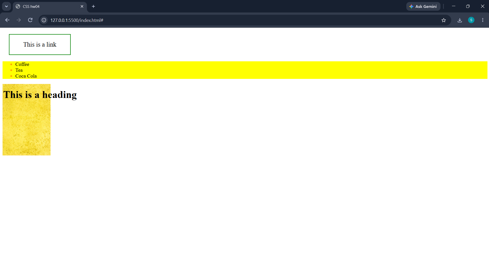

# CSS Homework 04

## 📌 Project Overview

This project demonstrates basic CSS styling and positioning using HTML5 and CSS3.

The webpage includes a styled link, an unordered list, an image, and a heading. The main goal is to practice different CSS properties, hover effects, pseudo-elements, and positioning.

## 🛠️ Technologies Used

* HTML5
* CSS3

## 📚 Concepts Practiced

In this project, I practiced:

* Styling elements using CSS
* Using `margin`, `padding`, `width`, and `border`
* Styling links using:

  * `text-decoration`
  * `color`
  * `font-size`
* Creating hover effects using `:hover`
* Changing background and text colors
* Styling unordered lists using `list-style-type`
* Customizing list markers using `::marker`
* Setting image dimensions using `width`
* Positioning elements using `position: absolute`
* Using `top` and `left` properties
* Controlling element stacking using `z-index`

## 📋 Features

The webpage includes:

* A styled link inside a bordered container
* Hover effect on the link container
* Link color changes when hovering
* An unordered list with:

  * Yellow background
  * Square list markers
  * Orange markers
* An image with a fixed width
* A heading positioned over the page using absolute positioning

## 📷 Preview

## 🎯 Learning Objective

The goal of this assignment was to understand the fundamentals of CSS styling, including hover effects, pseudo-elements, element positioning, and basic layout customization.

## 👨‍💻 Author

Saif Addeen

