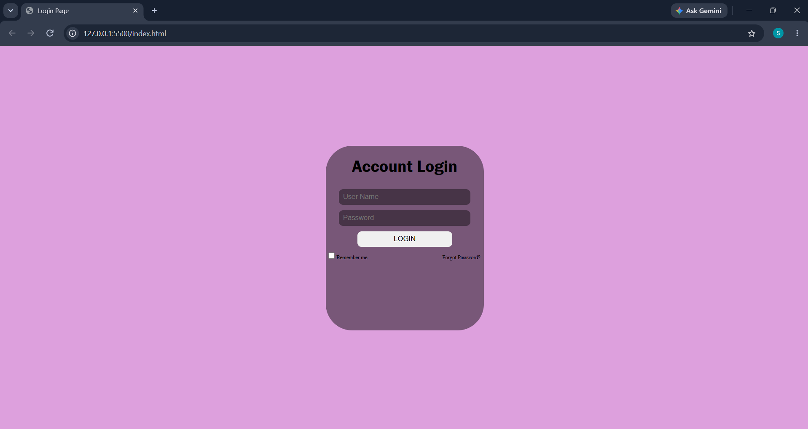

# Login Page

## 📌 Project Overview

This project is a simple Login Page created using HTML5 and CSS3.

The page allows users to enter their username and password, remember their login information, and access the forgot password option.

## 🛠️ Technologies Used

* HTML5
* CSS3

## 📚 Concepts Practiced

In this project, I practiced:

* Creating a login form structure using HTML

* Using different HTML elements:

  * Headings
  * Text input
  * Password input
  * Button
  * Checkbox
  * Label
  * Link

* Connecting labels with inputs using `for` and `id`

* Using form attributes:

  * `placeholder`
  * `required`
  * `id`

* Using CSS Flexbox for layout and alignment

* Using `justify-content` and `align-items`

* Styling inputs and buttons using CSS

* Using `margin`, `padding`, `width`, and `height`

* Creating rounded elements using `border-radius`

* Using `background-color` and `background-image`

* Using basic responsive design with media queries

## 📋 Features

The login page includes:

* Account Login title

* Username input field

* Password input field

* Login button

* Remember Me checkbox

* Forgot Password link

* Centered login card

* Styled input fields and button

* Background image

## 📷 Preview

## 🎯 Learning Objective

The goal of this assignment was to practice creating a simple login page using HTML and CSS, while understanding how to organize page elements and use Flexbox for layout and alignment.

## 👨‍💻 Author

Saif Addeen
