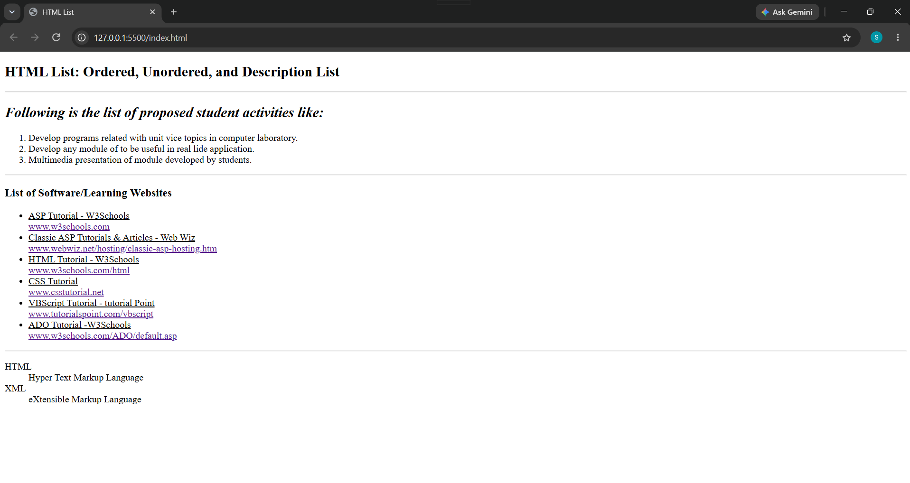

# HTML Lists

## 📌 Project Overview

This project demonstrates the different types of HTML lists using HTML5.

The page contains examples of:
- Ordered Lists
- Unordered Lists
- Description Lists

## 🛠️ Technologies Used

- HTML5

## 📚 Concepts Practiced

In this project, I practiced:

- Creating ordered lists using `<ol>`
- Creating unordered lists using `<ul>`
- Creating description lists using `<dl>`, `<dt>`, and `<dd>`
- Adding links using the `<a>` tag
- Using headings, paragraphs, horizontal lines, and basic HTML structure

## 📋 Features

The webpage includes:

- A list of proposed student activities using an ordered list.
- A list of learning websites using an unordered list.
- A description list explaining HTML and XML terms.
- External links that open in a new tab.

## 📷 Preview

## 🎯 Learning Objective

The goal of this assignment was to understand how to organize and display information using different types of HTML lists.
