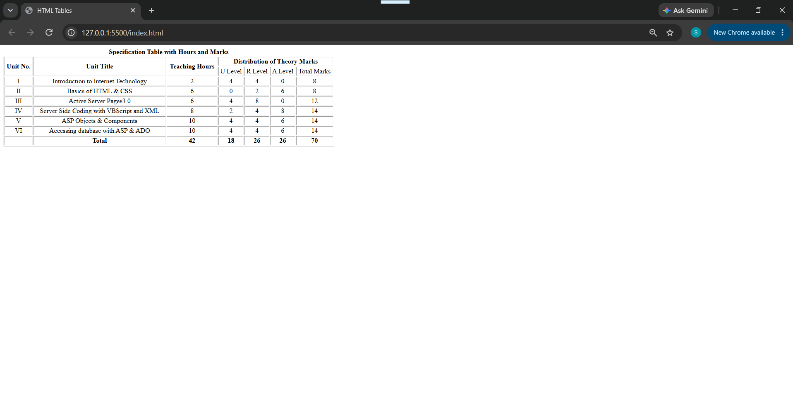

# HTML Tables

## 📌 Project Overview

This project demonstrates how to create and structure tables using HTML5.

The webpage contains a specification table that displays unit information, teaching hours, and distribution of theory marks.

## 🛠️ Technologies Used

- HTML5

## 📚 Concepts Practiced

In this project, I practiced:

- Creating tables using `<table>`
- Adding table rows using `<tr>`
- Adding table headers using `<th>`
- Adding table data using `<td>`
- Using table captions with `<caption>`
- Merging table cells using:
  - `rowspan`
  - `colspan`
- Controlling table borders and width

## 📋 Features

The table includes:

- Unit numbers and titles.
- Teaching hours for each unit.
- Distribution of theory marks.
- Total marks calculation.
- Merged header cells using rowspan and colspan.

## 📷 Preview

## 🎯 Learning Objective

The goal of this assignment was to understand how to organize and present structured data using HTML tables.

## 👨‍💻 Author
Saif Addeen
