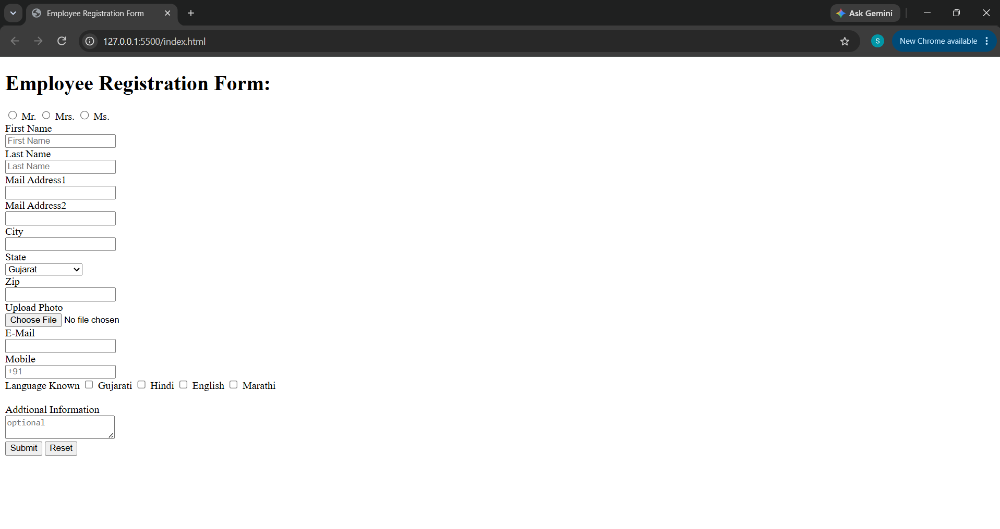

# Employee Registration Form

## 📌 Project Overview

This project is an Employee Registration Form created using HTML5.

The form allows users to enter personal information, contact details, address information, upload a photo, select known languages, and submit the data.

## 🛠️ Technologies Used

- HTML5

## 📚 Concepts Practiced

In this project, I practiced:

- Creating forms using `<form>`
- Using different input types:
  - Text input
  - Email input
  - Telephone input
  - File upload
  - Radio buttons
  - Checkboxes
- Creating dropdown menus using `<select>` and `<option>`
- Using `<textarea>` for additional information
- Connecting labels with inputs using `for` and `id`
- Using form attributes:
  - `name`
  - `value`
  - `placeholder`
  - `required`

## 📋 Features

The registration form includes:

- Employee title selection:
  - Mr.
  - Mrs.
  - Ms.

- Personal information:
  - First Name
  - Last Name

- Address information:
  - Mail Address
  - City
  - State
  - Zip Code

- Contact information:
  - Email
  - Mobile Number

- Photo upload field

- Language selection:
  - Gujarati
  - Hindi
  - English
  - Marathi

- Additional information field

- Submit and Reset buttons

## 📷 Preview

## 🎯 Learning Objective

The goal of this assignment was to understand how to create structured HTML forms and how different form elements collect user data.

## 👨‍💻 Author
Saif Addeen
